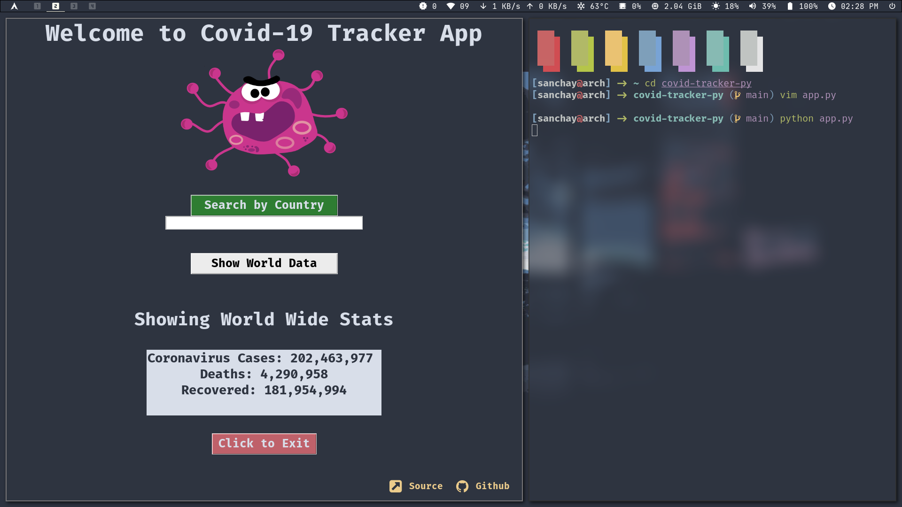

# covid-tracker-py
It's a simple GUI Application which provides live COVID-19 stats using Python's Tkinter and Beautiful Soup libraries.
You can search for any country using the search box or just view worldwide stats.

## Screenshots

## Libraries Used

* Tkinter
* Beautiful Soup
* requests

### Install the dependencies to try

* `pip install tkinter`

* `pip install beautifulsoup4`

* `pip install requests`

## Source

* https://www.worldometers.info/coronavirus/
